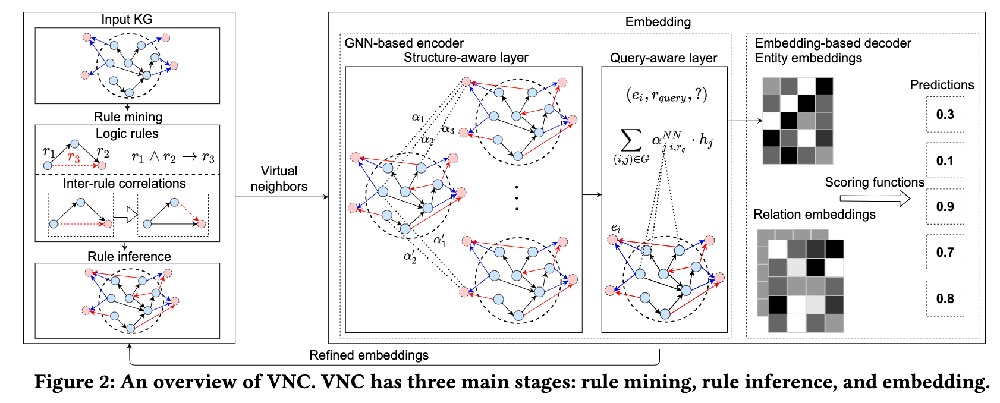
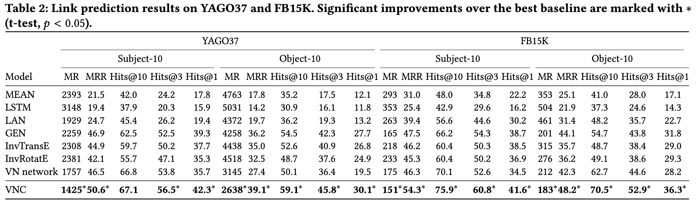

# VNC
This repo is a PyTorch implementation of "[Iteratively Learning Representations for Unseen Entities with Inter-Rule Correlations](https://arxiv.org/pdf/2305.10531.pdf)" (CIKM 2023).

## Introduction
Current KGE methods for out-of-knowledge-graph (OOKG) entities still face two key challenges:
1. Identifying inter-rule correlations to further facilitate the inference process;
2. Capturing interactions among rule mining, rule inference, and embedding to enhance both rule and embedding learning.

In this paper, we propose a virtual neighbor network with inter-rule correlations (VNC) to address the above challenges. VNC consists of three main components: (i) rule mining, (ii) rule inference, and (iii) embedding. To identify useful complex patterns in knowledge graphs, both logic rules and inter-rule correlations are extracted from knowledge graphs based on operations over relation embeddings. To reduce data sparsity, virtual networks for OOKG entities are predicted and assigned soft labels by optimizing a rule-constrained problem. We also devise an iterative framework to capture the underlying interactions between rule and embedding learning.
<div align=center>

</div>

## Main results
We assess the performance of VNC for link prediction on publicly available datasets, namely YAGO37 and FB15K.
<div align=center>

</div>

## Get started
We list commands with different hyperparameters in ```run.sh```. For example, you can train and evaluate VNC with the following command:
```python
python -u main_run.py --gpu 0 --penalty 0.5 --epochs 4000 --model "distmult" --embedding-dim 100 --evaluate-every 50  --data fb15k  --sub-data subject-10 --isSigmoid True  --n-bases 100  --batch-size 30000  --n_epochs_aux 200
```

## Reference
```
@inproceedings{wang2023Iterative,
  author    = {Zihan Wang, Kai Zhao, Yongquan He, Zhumin Chen, Pengjie Ren, Maarten de Rijke, and Zhaochun Ren},
  title     = {Iteratively Learning Representations for Unseen Entities with Inter-Rule Correlations},
  booktitle = {{CIKM} '23: the 32nd ACM International Conference on Information and Knowledge Management, October 21–25, 2023, Birmingham, UK.},
  year      = {2023}
}
```

